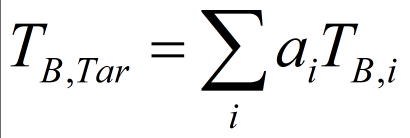
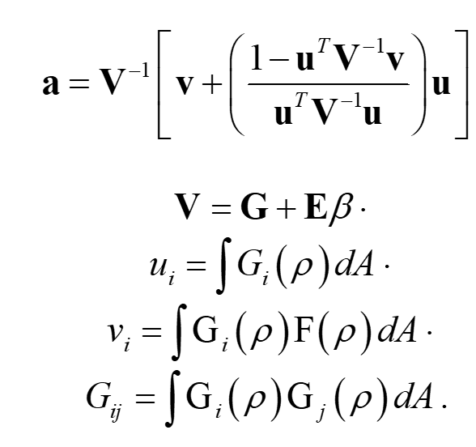

# Read Me for Fortran Code that calculates the resampling weights for brightness temperatures for the RSS ACCESS project
The code in the this repository calculates the resampling weights for resampling swath-geometry 
radiometer measurements onto circular footprints at specified locations in the swath geometry using the Backus-Gilbert method.

The inputs are:
* source footprints for a range of scans
* target footprints
These are generated in python.

So far, these have been generated for:
* AMSR2
* SSMIS
* SSM/I

The resampling uses a weighted average of the source footprints to closely approximate the
target footprint.

The weights are calculated using the following equations:

Here the Gi's describe the source footprints, and the Fi's describe the target footprint.  We normalize the source footprints so that the u's are 1.0

The resampling calculation is broken into two parts.

### First, the "g" matrix (Gij) is calculated.  
g is the overlap between pairs of source footprints.  Because
many footprints are too far apart to have any overlap, the matrix is fairly sparse.

The calculation is performed by calc_g_everywhere_{sat_name}.f90 which builds to calc_g_everywhere_{sat_name}.  

The run time depends on the size of the source footprints.  For the larger footprints at lower frequencies, it takes many hours.

Note that the g matrix is independent of the target size so it does not need to be recalculated for different target footprints or locations.

The output of this part is a file containing the g matrix.  Because it is relatively sparse, it is stored as i(int32),j(int32),value(real64) triplets.  The matrix is symmetric, so the i,j order is not important, but all values are stored (not just the upper or lower triangle).  

For AMSR2, the files are stored in L:\access\resampling\AMSR2\source_gains_v3\g_everywhere

For SSMIS F18, the files are stored in L:\access\resampling\SSMIS\f18\source_gains\g_everywhere

For SSMI F13, the files are stored in L:\access\resampling\SSMI\f13\source_gains\g_everywhere

### Second, the resampling weights are computed.  
This is done by find_resampling_weights_precomute_g.f90 which build to find_resampling_weights_precompute_g.  The most costly part of this process is calculating overlap integrals between the target footprint and the various source footprints included (the vi's).  Only source footprints within some distance of the target location are included in the calculations.  For the 30 km footprints we used 3X the footprint size, but for the 70 km footprints it was reduced to 2.5X the footprint size to speed up the calculation.

For AMSR2, the results are stored in:

L:\access\resampling\AMSR2\resample_weights\circular_30km\ and
L:\access\resampling\AMSR2\resample_weights\circular_70km\

For SSMIS, the results are stored in:

L:\access\resampling\SSMIS\f18\resample_weights\70km

